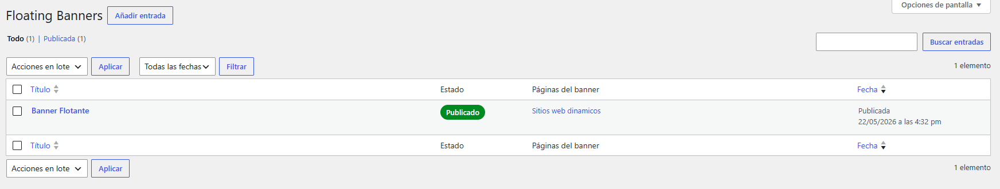
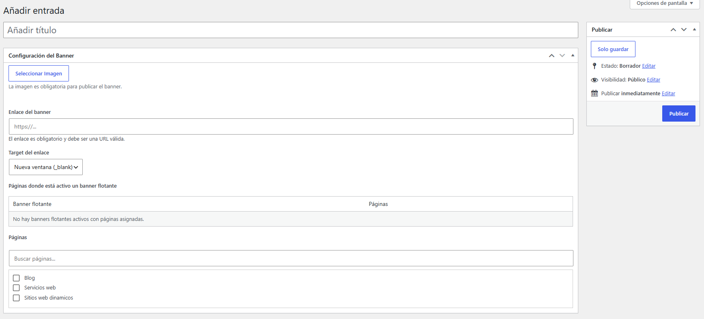

# SPEC Floating Banner

Plugin WordPress para gestionar banners flotantes por página desde un Custom Post Type privado.

## Descripción

SPEC Floating Banner permite crear banners flotantes que se muestran en páginas específicas del sitio. Cada banner requiere una imagen y un enlace, permite definir el target del enlace (`_self` o `_blank`) y se renderiza como un elemento flotante inferior izquierdo con botón de cierre temporal.

El plugin está pensado para administración interna: el CPT no es público, no genera URLs públicas propias y no modifica metadata SEO, canonicales, schema ni configuración de Yoast SEO.

## Funcionalidades

- CPT privado `sfb_banner` para administrar banners.
- Selector de imagen usando la librería de medios de WordPress.
- Link obligatorio con sanitización de URL.
- Target configurable: misma ventana o nueva ventana.
- Selección de páginas donde se mostrará cada banner.
- Prevención de publicación si falta imagen o enlace.
- Tabla informativa de banners flotantes activos y páginas asignadas.
- Columnas administrativas:
  - Estado: `Publicado` / `No publicado`.
  - Páginas del banner.
- Frontend con cierre temporal sin persistencia.
- Assets separados para admin y frontend.
- Internacionalización mediante text domain `spec-floating-banner`, traducción inglesa `en_US` y fallback interno para locales `en*`.

## Capturas

Sube las imagenes de referencia en `docs/images/` usando estos nombres para que se muestren aqui automaticamente.

### Listado en administrador



### Configuracion del banner flotante



### Vista en frontend


## Estructura

```text
spec-floating-banner/
  spec-floating-banner.php
  README.md
  assets/
    css/
      admin.css
      frontend.css
    js/
      admin.js
      frontend.js
  languages/
    spec-floating-banner.pot
    spec-floating-banner-en_US.po
    spec-floating-banner-en_US.mo
    spec-floating-banner-en_US.l10n.php
  docs/
    images/
      admin-list.png
      admin-config.png
      frontend.png
```

## Seguridad

El plugin aplica medidas estándar de seguridad WordPress:

- Bloqueo de acceso directo con `ABSPATH`.
- Validación de permisos con `current_user_can()`.
- Nonce para guardado desde el admin.
- Sanitización de entradas:
  - `absint()` para IDs.
  - `esc_url_raw()` para enlaces.
  - `sanitize_key()` y allowlist para target.
- Escape de salidas:
  - `esc_html()`.
  - `esc_attr()`.
  - `esc_url()`.
  - `wp_kses_post()` para markup controlado de imágenes.
- `rel="noopener noreferrer"` cuando el enlace abre en `_blank`.
- Validación de que las páginas asignadas sean realmente posts tipo `page`.

## SEO / GEO / AEO

- No crea páginas públicas nuevas.
- No modifica canonicales, metadescripciones, schema ni datos de Yoast SEO.
- El banner usa imagen de WordPress mediante `wp_get_attachment_image()`, conservando atributos responsivos cuando estén disponibles.
- La imagen incluye `alt` con fallback al título del adjunto o del banner.
- El contenedor frontend usa `aside` con `role="complementary"` y `aria-label`.

## Performance

- Los assets se cargan con `wp_enqueue_style()` y `wp_enqueue_script()`.
- Los assets frontend solo se cargan cuando la página actual tiene banners asignados.
- Las consultas usan `post_status => publish`, `no_found_rows => true` y `fields => ids` cuando aplica.
- No se usan archivos minificados generados ni proceso Gulp.

## Uso

1. Ir al administrador de WordPress.
2. Abrir `Floating Banners`.
3. Crear o editar un banner.
4. Seleccionar una imagen.
5. Agregar un enlace válido.
6. Elegir el target del enlace.
7. Seleccionar las páginas donde debe mostrarse.
8. Publicar.

Si falta imagen o enlace, el banner no podrá quedar publicado y pasará a borrador.

## Validación recomendada

Después de cambios en el plugin:

```bash
php -l spec-floating-banner.php
node --check assets/js/admin.js
node --check assets/js/frontend.js
```

Validar traducciones:

- Cambiar el idioma de WordPress o del usuario administrador a English (United States).
- Confirmar que el CPT, metabox, columnas administrativas, buscador, avisos, selector de medios y botón de cierre muestran textos en inglés.
- Volver a Español y confirmar que los textos originales se mantienen.

Nota: el plugin incluye fallback interno para locales `en*`, por lo que los textos visibles del administrador deben mostrarse en inglés incluso si WordPress no carga el archivo `.mo` o `.l10n.php`.

También se recomienda validar en WordPress:

- Creación y edición de banner.
- Publicación bloqueada sin imagen o enlace.
- Render frontend en una página asignada.
- Cierre temporal del banner.
- Target `_self` y `_blank`.
- Ausencia de errores visibles en consola.

## Rollback

Para revertir una versión problemática:

1. Restaurar `spec-floating-banner.php`.
2. Restaurar o eliminar los archivos modificados en `assets/`.
3. Restaurar o eliminar la carpeta `languages/`.
4. Limpiar cachés del sitio si aplica.
5. Verificar que el CPT `sfb_banner` siga accesible en el admin.

No hay migraciones de base de datos. El plugin usa post meta estándar de WordPress:

- `_sfb_image_id`
- `_sfb_link`
- `_sfb_target`
- `_sfb_pages`
