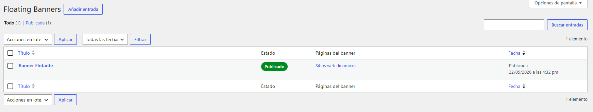
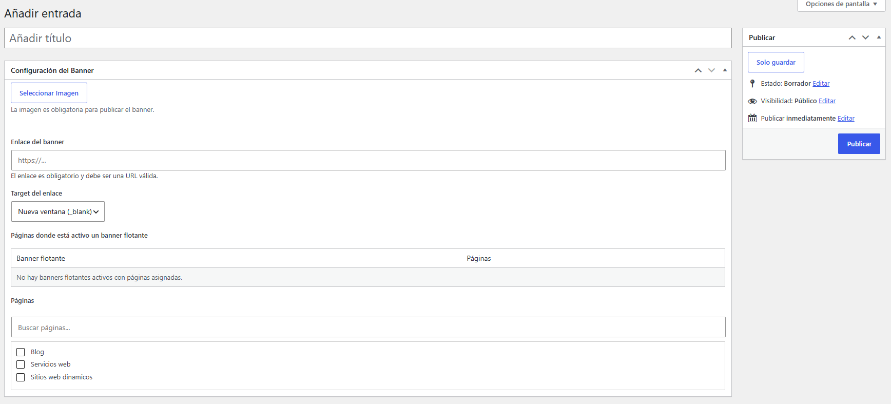

# SPEC Floating Banner

Plugin WordPress para gestionar banners flotantes por página desde un Custom Post Type privado.

## Descripción

SPEC Floating Banner permite crear banners flotantes que se muestran en páginas específicas del sitio. Cada banner puede configurarse como imagen con enlace opcional o como video con CTA configurable, permite definir el target del enlace (`_self` o `_blank`) y se renderiza como un elemento flotante inferior izquierdo con botón de cierre temporal.

El plugin está pensado para administración interna: el CPT no es público, no genera URLs públicas propias y no modifica metadata SEO, canonicales, schema ni configuración de Yoast SEO.

## Funcionalidades

- CPT privado `sfb_banner` para administrar banners.
- Selector de tipo de banner: imagen o video.
- Selector de imagen usando la librería de medios de WordPress.
- Selector de video usando la librería de medios de WordPress.
- Validación de videos permitidos: MP4 y WebM.
- Link opcional con sanitización para URL, `#` o anclas internas como `#formulario`.
- CTA para banners de video: nombre obligatorio, link opcional y target configurable.
- ID opcional del CTA para configurar seguimiento de clics con GTM.
- Target configurable: misma ventana o nueva ventana.
- Programación opcional con fecha de inicio y fecha de fin.
- Estado administrativo calculado por programación: sin fechas usa `Publicado` / `Borrador`; con fechas usa `Programado`, `Publicado` o `Borrador`.
- Cambio automático a borrador cuando la fecha de fin ya está vencida.
- Selección de páginas donde se mostrará cada banner.
- Selector de páginas con ruta jerárquica cuando la página tiene padre.
- Prevención de publicación si faltan los campos obligatorios según el tipo de banner.
- Tabla informativa de banners flotantes activos y páginas asignadas.
- Columnas administrativas:
  - Estado: `Publicado` / `No publicado`.
  - Tipo de pieza: `Imagen` / `Video`.
  - Páginas del banner.
- Frontend con cierre temporal sin persistencia.
- Assets separados para admin y frontend.
- Internacionalización mediante text domain `spec-floating-banner` y traducción inglesa `en_US`.

## Capturas

Sube las imágenes de referencia en `docs/images/` usando estos nombres para que se muestren aquí automáticamente.

### Listado en administrador



### Configuración del banner flotante



### Vista en frontend


## Estructura

```text
spec-floating-banner/
  spec-floating-banner.php
  README.md
  assets/
    css/
      admin.css
      frontend.css
    js/
      admin.js
      frontend.js
  languages/
    spec-floating-banner.pot
    spec-floating-banner-en_US.po
    spec-floating-banner-en_US.mo
    spec-floating-banner-en_US.l10n.php
  docs/
    images/
      admin-list.png
      admin-config.png
      frontend.png
```

## Seguridad

El plugin aplica medidas estándar de seguridad WordPress:

- Bloqueo de acceso directo con `ABSPATH`.
- Validación de permisos con `current_user_can()`.
- Nonce para guardado desde el admin.
- Sanitización de entradas:
  - `absint()` para IDs.
  - Sanitización propia para enlaces con URL, `#` o anclas internas.
  - `sanitize_text_field()` para nombre del CTA.
  - `sanitize_html_class()` para ID opcional del CTA.
  - `sanitize_key()` y allowlist para target.
- Escape de salidas:
  - `esc_html()`.
  - `esc_attr()`.
  - `esc_url()`.
  - `wp_kses_post()` para markup controlado de imágenes.
- `rel="noopener noreferrer"` cuando el enlace abre en `_blank`.
- Validación de que las páginas asignadas sean realmente posts tipo `page`.

## Código limpio y mantenibilidad

Este plugin debe mantenerse fácil de leer, mantener y extender:

- Funciones `sfb_` pequeñas y enfocadas en una sola responsabilidad.
- Nombres descriptivos para imagen, enlace, target, páginas y banners.
- Validaciones explícitas para URL, target, IDs y páginas asignadas.
- JS encapsulado, sin variables globales innecesarias, listeners duplicados ni `console.log`.
- CSS separado entre admin y frontend, con selectores acotados al plugin.
- Comentarios solo cuando expliquen una decisión que no sea evidente en el código.
- Reutilización de helpers existentes antes de duplicar lógica.

## SEO / GEO / AEO

- No crea páginas públicas nuevas.
- No modifica canonicales, metadescripciones, schema ni datos de Yoast SEO.
- El banner de imagen usa `wp_get_attachment_image()`, conservando atributos responsivos cuando estén disponibles.
- La imagen incluye `alt` con fallback al título del adjunto o del banner.
- El banner de video renderiza el archivo seleccionado con controles nativos y un CTA visible debajo.
- El contenedor frontend usa `aside` con `role="complementary"` y `aria-label`.

## Performance

- Los assets se cargan con `wp_enqueue_style()` y `wp_enqueue_script()`.
- Los assets frontend solo se cargan cuando la página actual tiene banners asignados.
- Las consultas usan `post_status => publish`, `no_found_rows => true` y `fields => ids` cuando aplica.
- No se usan archivos minificados generados ni proceso Gulp.

## Uso

1. Ir al administrador de WordPress.
2. Abrir `Floating Banners`.
3. Crear o editar un banner.
4. Elegir el tipo de banner.
5. Si es imagen, seleccionar una imagen y opcionalmente agregar un enlace válido, `#` o un ancla como `#formulario`.
6. Si es video, cargar un video MP4 o WebM, agregar nombre CTA y opcionalmente link CTA con URL, `#` o un ancla como `#formulario`.
7. Opcionalmente agregar un ID al CTA para seguimiento de clics con GTM.
8. Opcionalmente definir fecha de inicio y fecha de fin de publicación.
9. Seleccionar las páginas donde debe mostrarse.
10. Publicar.

Si faltan campos obligatorios según el tipo seleccionado, el banner no podrá quedar publicado y pasará a borrador.

## Validación recomendada

Después de cambios en el plugin:

```bash
php -l spec-floating-banner.php
node --check assets/js/admin.js
node --check assets/js/frontend.js
```

Validar traducciones:

- Cambiar el idioma de WordPress o del usuario administrador a English (United States).
- Confirmar que el CPT, metabox, columnas administrativas, buscador, avisos, selector de medios y botón de cierre muestran textos en inglés.
- Volver a Español y confirmar que los textos originales se mantienen.

También se recomienda validar en WordPress:

- Creación y edición de banner.
- Selector de páginas mostrando jerarquía padre/hija.
- Columna de tipo de pieza en listado del CPT y tabla de banners activos.
- Publicación bloqueada sin imagen en banners de imagen.
- Publicación bloqueada sin video MP4/WebM o nombre CTA en banners de video.
- Enlaces opcionales con URL, `#` y anclas como `#formulario`.
- Render frontend en una página asignada.
- Render frontend respetando fecha de inicio futura y fecha de fin vencida.
- Confirmar que un banner publicado con fecha de fin vencida pasa automáticamente a borrador en el administrador.
- Render frontend de video con CTA visible debajo.
- Cierre temporal del banner.
- Target `_self` y `_blank`.
- Ausencia de errores visibles en consola.

## Rollback

Para revertir una versión problemática:

1. Restaurar `spec-floating-banner.php`.
2. Restaurar o eliminar los archivos modificados en `assets/`.
3. Restaurar o eliminar la carpeta `languages/`.
4. Limpiar cachés del sitio si aplica.
5. Verificar que el CPT `sfb_banner` siga accesible en el admin.

No hay migraciones de base de datos. El plugin usa post meta estándar de WordPress:

- `_sfb_image_id`
- `_sfb_media_type`
- `_sfb_video_id`
- `_sfb_cta_label`
- `_sfb_cta_id`
- `_sfb_link`
- `_sfb_target`
- `_sfb_start_date`
- `_sfb_end_date`
- `_sfb_pages`
