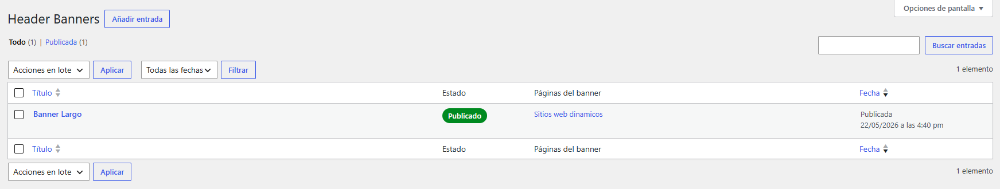
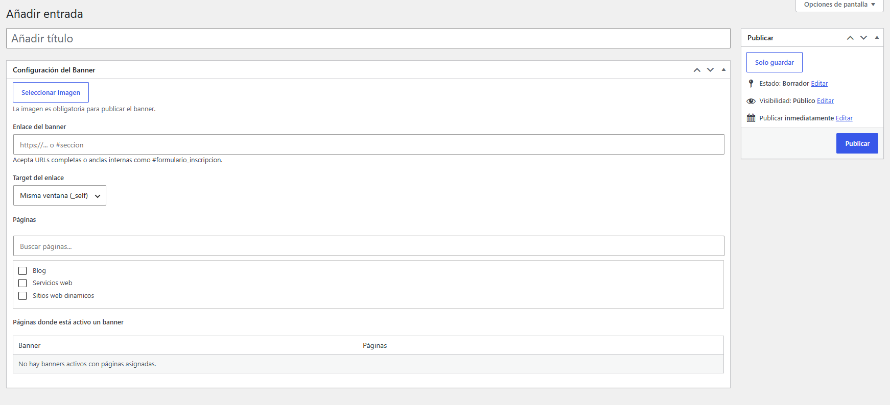

# SPEC Header Banner

Plugin WordPress para gestionar múltiples banners full width en formato imagen o cenefa de texto, y ubicarlos bajo breadcrumbs cuando existan o bajo el header como fallback.

## Descripción

SPEC Header Banner usa un Custom Post Type privado (`shb_banner`) para administrar varios banners independientes. Cada banner puede configurarse como imagen con enlace opcional o como cenefa de texto con colores personalizables, y mantiene selección de páginas con buscador.

Para evitar conflictos visuales, una página asignada a un banner publicado queda bloqueada al configurar otros banners, siguiendo el mismo criterio usado en los plugins de modales y banners flotantes.

## Funcionalidades

- CPT privado `shb_banner`.
- Múltiples banners.
- Tipo de contenido configurable: banner de imagen o cenefa de texto.
- Imagen obligatoria para banners de imagen.
- Enlace opcional para banners de imagen.
- Target `_self` o `_blank` para banners de imagen.
- Texto, color de letra y color de fondo para cenefas de texto.
- Programación opcional con fecha de inicio y fecha de fin.
- Estado administrativo calculado por programación: sin fechas usa `Publicado` / `Borrador`; con fechas usa `Programado`, `Publicado` o `Borrador`.
- Cambio automático a borrador cuando la fecha de fin ya está vencida.
- Checklist de páginas con buscador y ruta jerárquica padre/hija.
- Bloqueo de páginas ya usadas por otros banners publicados.
- Tabla informativa de banners activos y páginas asignadas.
- Columnas administrativas:
  - Estado.
  - Páginas del banner.
- Banner full width en frontend.
- Inserción inicial con `wp_body_open` y fallback en `wp_footer`.
- Reubicación frontend: en home/front-page queda bajo el header; en páginas internas queda bajo el contenedor externo de breadcrumbs propios, Yoast, Rank Math o Breadcrumb NavXT cuando exista; si no existen breadcrumbs, queda bajo el header. El banner no debe quedar anidado dentro del header ni dentro del contenedor de breadcrumbs.
- Internacionalización mediante text domain `spec-header-banner` y traducción inglesa `en_US`.

## Capturas

Sube las imágenes de referencia en `docs/images/` usando estos nombres para que se muestren aquí automáticamente.

### Listado en administrador



### Configuración del banner



### Vista en frontend


## Seguridad

- Bloqueo de acceso directo con `ABSPATH`.
- CPT no público.
- Nonce en guardado.
- Validación de permisos con `current_user_can()`.
- Sanitización con `absint()`, `esc_url_raw()` y allowlist de target.
- Validación de páginas tipo `page`.
- Escape de salida con `esc_html()`, `esc_attr()`, `esc_url()` y `wp_kses_post()`.
- `rel="noopener noreferrer"` cuando el enlace abre en nueva ventana.
- Sin CSS/JS inline.

## Código limpio y mantenibilidad

Este plugin debe mantenerse claro, modular y seguro de extender:

- Funciones `shb_` pequeñas y separadas por responsabilidad.
- Nombres descriptivos para imagen, enlace, target, páginas, breadcrumbs y fallback.
- Lógica de ubicación bajo breadcrumbs/header legible y documentada cuando cambie.
- Validaciones explícitas para IDs, URL, target y páginas asignadas.
- JS encapsulado, sin variables globales innecesarias, listeners duplicados ni `console.log`.
- CSS separado entre admin y frontend, sin efectos laterales sobre el tema.
- Comentarios solo cuando aporten contexto útil sobre compatibilidad o decisiones técnicas.

## SEO / GEO / AEO

- No crea URLs públicas ni páginas indexables propias.
- No modifica canonicales, metadata, schema ni Yoast SEO.
- Renderiza una imagen visible o una cenefa de texto a ancho completo.
- Usa `wp_get_attachment_image()` para preservar atributos generados por WordPress.

## Estructura

```text
spec-header-banner/
  spec-header-banner.php
  README.md
  assets/
    css/
      admin.css
      frontend.css
    js/
      admin.js
      frontend.js
  languages/
    spec-header-banner.pot
    spec-header-banner-en_US.po
    spec-header-banner-en_US.mo
    spec-header-banner-en_US.l10n.php
  docs/
    images/
      admin-list.png
      admin-config.png
      frontend.png
```

## Validación recomendada

```bash
php -l spec-header-banner.php
node --check assets/js/admin.js
node --check assets/js/frontend.js
```

Validar traducciones:

- Cambiar el idioma de WordPress o del usuario administrador a English (United States).
- Confirmar que el metabox, columnas administrativas, buscador, avisos y modal de medios muestran textos en inglés.
- Volver a Español y confirmar que los textos originales se mantienen.

Validar en WordPress:

- Crear dos banners.
- Asignar páginas al primero.
- Confirmar que el selector muestra jerarquía de páginas cuando existen padres.
- Confirmar que esas páginas quedan bloqueadas en el segundo.
- Publicar un banner con imagen.
- Publicar una cenefa de texto con color de letra y color de fondo.
- Confirmar que una cenefa de texto sin texto queda como borrador y muestra aviso.
- Configurar fecha de inicio futura y confirmar que no se renderiza antes de la vigencia.
- Configurar fecha de fin vencida y confirmar que no se renderiza después de la vigencia.
- Confirmar que un banner publicado con fecha de fin vencida pasa automáticamente a borrador en el administrador.
- Confirmar que en home/front-page aparece full width bajo el header, sin quedar anidado dentro del header.
- Confirmar que en páginas internas aparece full width bajo el contenedor externo de breadcrumbs si existe, sin quedar anidado dentro del contenedor.
- Confirmar que aparece bajo el header cuando no hay breadcrumbs.
- Probar target `_self` y `_blank`.

## Migración

El plugin intenta migrar una configuración antigua basada en opciones a un banner tipo `shb_banner` en borrador. Opciones antiguas reconocidas:

- `shb_pages`
- `shb_image_id`
- `shb_link`
- `shb_target`
- `banner_pages`
- `banner_image`
- `banner_link`
- `banner_target`

## Rollback

Restaurar `spec-header-banner.php`, `README.md`, los archivos dentro de `assets/` y la carpeta `languages/`. El plugin usa post meta:

- `_shb_image_id`
- `_shb_link`
- `_shb_target`
- `_shb_content_type`
- `_shb_text`
- `_shb_text_color`
- `_shb_background_color`
- `_shb_start_date`
- `_shb_end_date`
- `_shb_pages`
