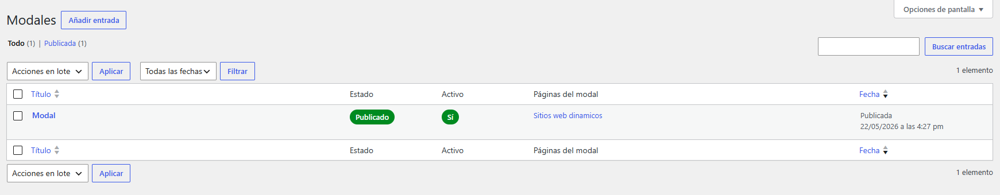
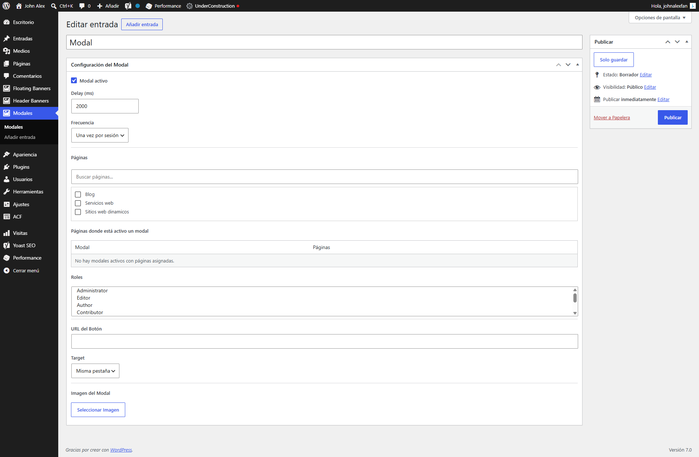
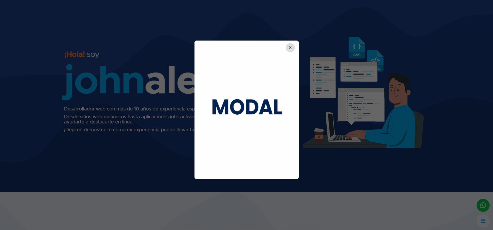

# SPEC Modal Pro

Plugin WordPress para gestionar modales promocionales segmentados por página y rol.

## Descripción

SPEC Modal Pro crea un Custom Post Type privado (`smp_modal`) para administrar modales con imagen clickeable, frecuencia, roles y páginas asignadas. El plugin no crea URLs públicas propias y no modifica metadata SEO, canonicales, schema ni configuración de Yoast SEO.

## Funcionalidades

- CPT privado para modales.
- Estado activo/inactivo por modal.
- Segmentación por páginas.
- Segmentación por roles de usuario.
- Delay configurable.
- Frecuencia `session` o `persistent` de 1 hora.
- URL y target para enlazar la imagen del modal.
- Imagen obligatoria para publicar.
- Columnas administrativas de estado, activo y páginas asignadas.
- Tabla informativa de páginas donde hay modales activos.
- Assets separados para admin y frontend.
- Internacionalización mediante text domain `spec-modal-pro` y traducción inglesa `en_US`.

## Capturas

Sube las imagenes de referencia en `docs/images/` usando estos nombres para que se muestren aqui automaticamente.

### Listado en administrador



### Configuracion del modal



### Vista en frontend



## Seguridad

- Bloqueo de acceso directo con `ABSPATH`.
- Nonce en guardado de metabox.
- Validación de permisos con `current_user_can()`.
- Sanitización con `absint()`, `sanitize_key()`, `sanitize_text_field()` y `esc_url_raw()`.
- Allowlists para frecuencia, target y modo de imagen.
- Validación de páginas tipo `page`.
- Validación de roles contra roles existentes de WordPress.
- Escape de salida con `esc_html()`, `esc_attr()`, `esc_url()` y `wp_kses_post()`.
- `rel="noopener noreferrer"` cuando el enlace abre en nueva pestaña.

## SEO / GEO / AEO

- No genera CPT público ni URLs indexables propias.
- No duplica metadata, canonicales ni schema de Yoast.
- Usa HTML accesible para el modal con `role="dialog"` y `aria-modal="true"`.
- Las imágenes se renderizan mediante `wp_get_attachment_image()`.

## Estructura

```text
spec-modal-checklist/
  spec-modal-checklist.php
  README.md
  assets/
    css/
      admin.css
      frontend.css
    js/
      admin.js
      frontend.js
  languages/
    spec-modal-pro.pot
    spec-modal-pro-en_US.po
    spec-modal-pro-en_US.mo
    spec-modal-pro-en_US.l10n.php
  docs/
    images/
      admin-list.png
      admin-config.png
      frontend.png
```

## Validación recomendada

```bash
php -l spec-modal-checklist.php
node --check assets/js/admin.js
node --check assets/js/frontend.js
```

Validar traducciones:

- Cambiar el idioma de WordPress o del usuario administrador a English (United States).
- Confirmar que el CPT, metabox, columnas administrativas, roles, frecuencia, selector de medios y botón de cierre muestran textos en inglés.
- Volver a Español y confirmar que los textos originales se mantienen.

Validar en WordPress:

- Crear y editar modal.
- Seleccionar imagen.
- Guardar URL y target.
- Asignar páginas y roles.
- Revisar columnas administrativas.
- Verificar render frontend, cierre y frecuencia.

## Rollback

Restaurar `spec-modal-checklist.php`, los archivos en `assets/` y la carpeta `languages/`. No hay migraciones de base de datos; el plugin usa post meta estándar:

- `_smp_enabled`
- `_smp_delay`
- `_smp_frequency`
- `_smp_pages`
- `_smp_roles`
- `_smp_cta_url`
- `_smp_cta_target`
- `_smp_image_id`
